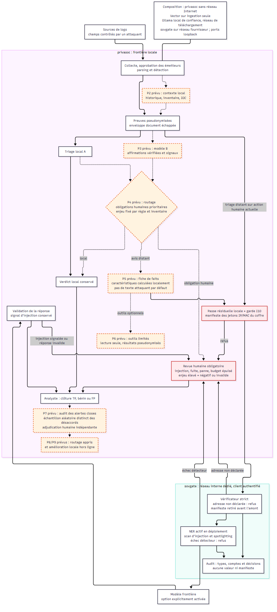

# privasoc+

**English** | [Français](README.fr.md)

**A local SOC that triages its alerts with a small local LLM, and asks a frontier model for a second opinion only through a gateway that checks nothing personal leaves.**

privasoc+ brings two components together in one repository:

- **privasoc**: log collection (Vector), parsers written by the local model and approved by a human, Sigma detection, structured alert triage, an evaluation bench. Everything is pseudonymised before it reaches a model, even a local one.
- **sovgate**: an OpenAI-compatible egress gateway. For privasoc it does not pseudonymise a second time: it **verifies** that only tokens minted by privasoc leave, isolates the evidence (spotlighting against prompt injection) and keeps a hash-chained audit log.

AI assistants: start with [AGENTS.md](AGENTS.md) (in French).

## Status (2026-10-07)

| Phase | Status |
|---|---|
| P1 Secure way out, privasoc to sovgate | implemented, tested against a simulated provider; Docker and real NER still to validate |
| P0 Triage measurement | 38-case bench and harness delivered, thresholds fixed before any measurement; **no model results yet** |
| P2 to P10 Enrichment, signals, routing, fact sheet | to do ([plan](docs/INTEGRATION_PLAN.md), in French) |

Remote triage stays a human action: nothing escalates automatically. Details and hand-over: [docs/PROGRESS.md](docs/PROGRESS.md) (in French).

## Architecture



1. **Enrich first** with local context (host history, past alerts of the rule, asset inventory, local IOCs), then run the local triage again.
2. **Detect uncertainty from facts**: disagreement between two local models, model claims checked against the database, validation checks. The confidence the model gives itself is only a secondary signal ([why](docs/alternatives.md)).
3. **Route by stakes** to the local model, a frontier model or the analyst. A "benign" verdict on a severe alert always goes to the analyst; the frontier model never lowers a verdict on its own.
4. **Send a fact sheet**, not logs: a structured, pseudonymised summary without attacker-controlled strings.
5. **privasoc pseudonymises, sovgate verifies**: only the gateway can reach the provider; an address missing from the token manifest blocks the call.
6. **Measure continuously** through random audits of closed alerts; later, learned routing and a frontier model acting as the local model's "teacher".

Points 1 to 4 and 6 are planned; point 5 and the measurement (triage bench) are implemented.

## Layout

| Path | Content |
|---|---|
| [packages/privasoc](packages/privasoc) | local SOC (package `privasoc`, CLI `privasoc`) |
| [packages/gateway](packages/gateway) | sovgate gateway (package `sovereign-llm-gateway`) |
| [integration/](integration/) | contract tests between the two |
| [deploy/](deploy/) | Docker composition: privasoc, Vector, local model, optional gateway |
| [docs/](docs/), [diagram/](diagram/) | design, decisions, plan, progress (in French) |

A [uv](https://docs.astral.sh/uv/) workspace: one `pyproject.toml` and one `uv.lock` at the root.

## Getting started

Requirements: uv, the [Vector](https://vector.dev/download/) binary (the parser sandbox) and an OpenAI-compatible server for the local model, for example [Ollama](https://ollama.com) with `qwen3:8b`.

```bash
uv sync --all-packages
cd packages/privasoc
uv run privasoc init                 # writes .env with fresh secrets; set the model and Vector there
uv run privasoc serve                # API and review UI on http://127.0.0.1:8000/ui/
```

The full privasoc guide (onboarding a source, parsers, detection, triage, hunting) is in [packages/privasoc/README.md](packages/privasoc/README.md); the gateway's in [packages/gateway/README.md](packages/gateway/README.md). Docker deployment: [deploy/README.md](deploy/README.md) (in French).

### Measuring the triage

```bash
cd packages/privasoc
uv run privasoc eval triage --set all --runs 3     # local model
uv run privasoc eval triage-report                 # reports/triage.md
```

Protocol and thresholds, fixed before any result: [docs/DECISIONS.md](docs/DECISIONS.md) (PD23) and privasoc's historical log (D57).

### Tests

```bash
uv run ruff check .
(cd packages/privasoc && uv run pytest -q)       # Vector tests are skipped without the binary
(cd packages/gateway && uv run pytest -q)
uv run pytest -q integration
```

## Documentation

The design documents are in French.

| File | Content |
|---|---|
| [docs/PROGRESS.md](docs/PROGRESS.md) | what is done, how to check it, next actions |
| [docs/DECISIONS.md](docs/DECISIONS.md) | decision log (PD), findings (N), open questions (Q) |
| [docs/INTEGRATION_PLAN.md](docs/INTEGRATION_PLAN.md) | 11-phase plan and tracking |
| [docs/CONTEXT.md](docs/CONTEXT.md) | how the two packages work |
| [docs/alternatives.md](docs/alternatives.md) | why not a simple confidence threshold |
| [docs/metrics.md](docs/metrics.md) | calibration, cost rule, metrics, evaluation protocol |
| [docs/constraints.md](docs/constraints.md) | security, privacy and law, operations |
| [docs/feasibility.md](docs/feasibility.md) | initial integration analysis |
| [docs/MANUAL_SAMPLES.md](docs/MANUAL_SAMPLES.md) | ingestion trials on public samples |
| [diagram/diagram-notes.md](diagram/diagram-notes.md) | diagram notes (current v3, historical v1 and v2) |
| [packages/privasoc/docs/DECISIONS.md](packages/privasoc/docs/DECISIONS.md) | privasoc's historical log (D1 to D62, I1 to I48), frozen, in English |

## Known limits

- The confidence an 8B model reports is overconfident and can be manipulated by injection; it never routes on its own ([metrics.md](docs/metrics.md)).
- Triage evidence only holds the events that matched the rule, and pseudonymised domain and user names hide what made them suspicious (finding N27): phases P2 and P5 address this.
- An unknown model server on the local network is still a trusted component (N28).
- Pseudonymised logs are still personal data: legal prerequisites apply before any use on third-party data ([constraints.md](docs/constraints.md)). Nothing here is legal advice.

## Licence

MIT, see [LICENSE](LICENSE). The gateway's default NER model, `urchade/gliner_multi_pii-v1`, is Apache-2.0; SigmaHQ rules (DRL 1.1) and Elastic fixtures (ELv2) are downloaded at run time and never committed.
