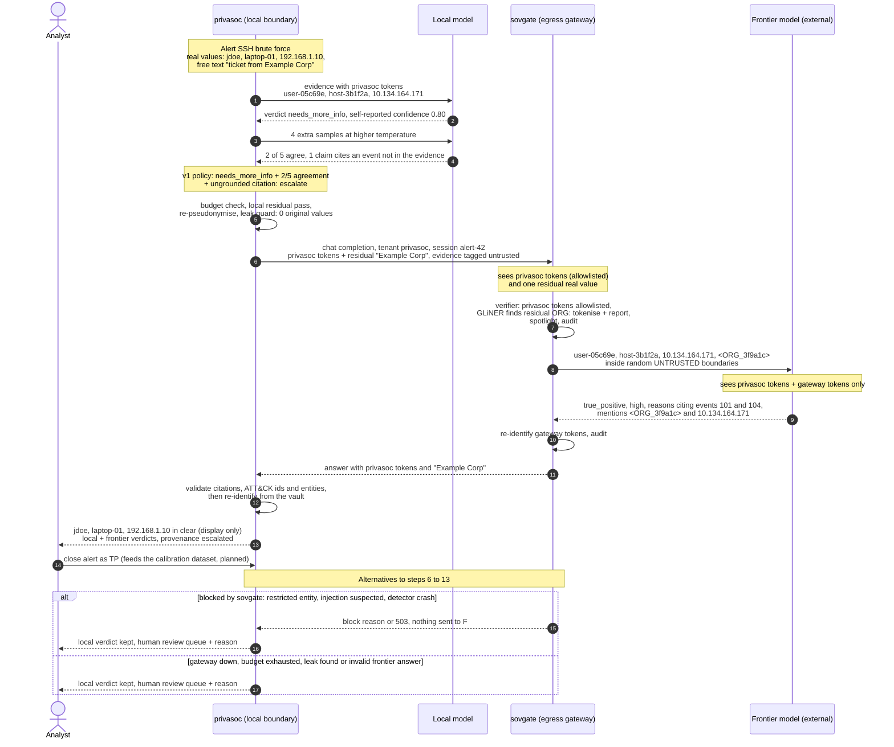

# privasoc+ : notes sur le diagramme d'architecture

## Revue 3 (version actuelle)

La v3 reflète PD24 à PD28 : manifeste IP/MAC authentifié, réseaux internes séparés,
modèle local dans la composition et activation explicite du distant. Le NER est actif
en déploiement ; les tests conservent un backend sans modèle. Le signal d’injection est
conservé et impose une revue humaine : `on_detect: flag` ne signifie pas blocage avant
l’amont. Le diagramme v2 dessinait ce blocage à tort. Les phases P2 à P10 restent prévues.

La portée session ne change pas les jetons déterministes de privasoc. L’audit P7 porte
sur les alertes closes, avec une vérité humaine indépendante et un traitement distinct
des désaccords. Aucun dessin ne vaut une preuve de zéro fuite ou de bénéfice du distant.

## Versions

| Version | Fichiers | Statut |
|---|---|---|
| **v3 (retenue)** | `architecture-v3.mmd`, `.svg`, `.png` | Contrat et priorités corrigés, séparation du déploiement, composants prévus explicités. |
| v2 (historique) | `architecture-v2.mmd`, `.svg`, `.png` | Architecture actuelle : enrichissement, deux modèles locaux, affirmations vérifiables, routage par l'enjeu à trois destinations, fiche de faits, audit aléatoire, professeur (DECISIONS PD10 à PD18). |
| v1 (historique) | `diagram.mmd`, `.svg`, `.png`, `sequence.svg` | Première version, centrée sur un score de confiance et un seuil (PD0, remplacé). Les zones de confiance, le rôle de sovgate et les branches de repli restent valables ; le reste de ce fichier décrit la v1. |

## Lecture de la v2

- **Zones** : identiques à la v1 (local, passerelle sur loopback, externe).
- **Orange** : nouveau ; **gris** : privasoc existant ; **bleu** : sovgate existant ; **rouge** : pas de sortie, revue humaine ; **jaune** : décision de routage.
- **Flèches épaisses** : chemin d'escalade (fiche de faits, sovgate, modèle frontière, validation, analyste). **Pointillées** : optionnel ou plus tard (outils P6, audit en lot P7, routage appris P8, professeur P9).
- Les étiquettes P2 à P9 renvoient aux phases de `docs/INTEGRATION_PLAN.md`.
- Différence clé avec la v1 : il n'y a plus de « score >= seuil ». Le routage combine l'enjeu (sévérité, criticité de l'actif, sens du verdict) et des signaux vérifiables (désaccord entre deux modèles, affirmations fausses, validation). Le modèle frontière reçoit une fiche de faits, pas les preuves.
- La séquence `sequence.svg` (v1) reste représentative du trajet d'une escalade dans sovgate ; dans la v2, la charge utile est la fiche de faits au lieu des événements.

Source du diagramme : `diagram.mmd` (rendu : `diagram.svg`). Séquence ci-dessous (rendu : `sequence.svg`).

## Les trois zones de confiance

| Zone | Contenu | Ce qui peut s'y trouver |
|---|---|---|
| **Zone 1 : Local privacy boundary (privasoc)** | Collecte, parsing, détection, hunting, modèle local, triage, estimateur de confiance, analyste | Valeurs réelles (logs bruts, vault chiffré). Toute sortie vers un modèle passe par la pseudonymisation et le leak guard de `LLMClient.chat`. |
| **Zone 2 : Egress gateway (sovgate)** | Proxy OpenAI-compatible, toujours sur la machine ou le LAN | Jetons privasoc (`user-05c69e`, `10.134.164.171`...) et, au pire, des entités résiduelles que privasoc a manquées : c'est précisément le rôle de la deuxième couche de détection. Audit sans valeurs brutes. |
| **Zone 3 : External** | Fournisseur du modèle frontier | Uniquement des jetons privasoc et, pour un nom résiduel en texte libre trouvé par GLiNER, un jeton gateway typé (`<ORG_3f9a1c>`), le tout dans des balises d'isolement aléatoires. |

## Existant vs nouveau (couleurs)

- **Gris** : composants privasoc déjà implémentés, regroupés par plan (collecte et onboarding, parsing, détection, hunting et rédaction de règles) au lieu de redessiner chaque boîte. Le triage local, sa validation (`triage.validate`), la passe résiduelle locale (`_local_residual_rules`), le leak guard et la ré-identification existent déjà.
- **Bleu** : composants sovgate existants (`Gateway.prepare` puis `Gateway.restore`, routeur, audit chaîné). Seule nouveauté côté sovgate : la configuration d'un tenant `privasoc` (voir plus bas).
- **Orange** : nouveau dans privasoc+ (self-consistency, estimateur de confiance, carte de calibration, validation de la réponse frontier, enregistrement de triage escaladé, jeu de calibration, réglage du seuil).
- **Jaune** : décisions nouvelles (politique d'escalade, budget). **Rouge** : branches où rien ne sort ; le verdict local est conservé et l'alerte part en file de revue humaine, jamais clôturée automatiquement.

## Flèches

- **Épaisses** : chemin d'escalade de privasoc+, du verdict local jusqu'à l'analyste en passant par le gateway et le modèle frontier.
- **Fines** : flux existants et branches de repli (bloqué, restricted, budget épuisé, gateway indisponible, fuite détectée, réponse invalide), toutes vers la file de revue humaine (« Human review queue »). Les règles dures v1 (verdict bénin ou faux positif sur une alerte high/critical, injection signalée) y envoient aussi directement.
- **Pointillées** : prévu ou optionnel. Boucle de calibration (il faut d'abord assez d'alertes clôturées TP/FP pour apprendre la carte et régler le seuil ; d'ici là, règle v1 à base de règles dures, voir `../docs/metrics.md` section 6, et non un seuil unique à 0,70) et passage futur des autres appels distants (fallback de génération de parser, rédaction de règles) par le même gateway.

## Ancrage dans le code

- **Confiance actuelle** : `triage.validate` borne le `confidence` auto-déclaré entre 0 et 1 (0 s'il n'est pas numérique) et produit une liste `problems` (JSON invalide, verdict inconnu, citation d'un événement absent, réclamation sans citation, ATT&CK mal formé, valeur absente de l'évidence). Le score auto-déclaré seul n'est pas fiable : l'estimateur combine ce chiffre avec l'accord entre N échantillons, le nombre et le type de `problems`, un verdict `needs_more_info`, `Reply.prompt_truncated` (fenêtre Ollama dépassée, cause d'hallucinations selon I24), le niveau de la règle, puis applique une carte de calibration apprise sur les clôtures TP/FP de l'analyste (D52).
- **Choix du fournisseur** : aujourd'hui `_endpoint(s, provider)` choisit `local` ou `remote` sur action humaine. Dans privasoc+, l'endpoint `remote` pointe vers l'URL de sovgate, et la décision est prise par la porte de confiance. Le leak guard de `LLMClient.chat` et la passe résiduelle locale (D49) restent obligatoires avant l'appel.
- **Gateway** : ordre réel de `Gateway.prepare` : détection (regex + checksums, GLiNER, propagation des noms), scan d'injection, routage (`router.decide`), pseudonymisation, spotlighting. `restore` ré-identifie le texte et le JSON des tool calls. Crash d'un détecteur : 503 et entrée d'audit (fail-closed).

## Configuration du tenant `privasoc` dans sovgate

- **sovgate vérifie, privasoc pseudonymise** : sovgate n'est pas un second pseudonymiseur. Une IP ou une MAC hors des plages de jetons privasoc est bloquée (fuite privasoc, à transformer en règle apprise). Seuls les noms résiduels en texte libre (GLiNER PERSON / ORG) sont pseudonymisés et signalés à privasoc comme propositions de règle (D33). Voir `../docs/feasibility.md` section 2.2.
- **Pas de double pseudonymisation** : les formes de jetons privasoc (`user-xxxxxx`, `host-xxxxxx`, domaines `dxxxxxx.*`, 10/8, 198.18.0.0/15, 2001:db8::/32, e-mails `uxxxxxx@...`) sont en liste blanche. Sans cela, le regex EMAIL de sovgate re-pseudonymiserait les e-mails privasoc, ce qui casse la ré-identification (bug déjà rencontré dans privasoc, I33).
- **Évidence non fiable** : les champs de log sont contrôlés par l'attaquant ; privasoc entoure l'évidence d'une balise ajoutée à `untrusted_tags`, que sovgate scanne puis isole par des frontières aléatoires.
- **restricted : block** (au lieu de `local`) : privasoc a déjà son verdict local, le gateway renvoie simplement la raison. **Injection suspectée : block** : une tentative d'injection dans un log est elle-même un signal, l'alerte reste locale et passe en revue humaine. Les faux positifs des détecteurs CREDIT_CARD, PHONE_CH et AHV sur les logs (horodatages en ms, SID) doivent être neutralisés dans ce profil, sinon ils bloquent l'escalade sans raison.
- `pseudonym_scope: session` avec `X-Session-Id` = identifiant d'alerte.

## Limites connues

- Les jetons privasoc sont déterministes (HMAC à clé) : le fournisseur peut relier un même hôte pseudonymisé entre plusieurs escalades. Une re-clé par escalade est possible mais complique le cache de règles apprises.
- Un attaquant qui injecte du texte peut forcer le blocage de l'escalade ; l'alerte est alors signalée, jamais silencieusement acceptée.
- Le modèle local lit aussi l'évidence ; appliquer le même spotlighting au prompt local est une amélioration à prévoir.

## Séquence : une demande de triage escaladée

Valeurs fictives : utilisateur `jdoe`, poste `laptop-01`, source `192.168.1.10`, organisation « Example Corp » dans un champ texte libre que les détecteurs privasoc ont manquée.

