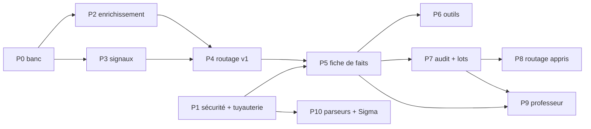

# privasoc+ : plan d'intégration

Version du 2026-10-07, revue 3. Statut global : **P1 implémenté, validation opérationnelle restante ; P0 banc livré, mesures de modèles restantes** (détail dans [PROGRESS.md](PROGRESS.md)). Ce plan met en oeuvre les décisions de [DECISIONS.md](DECISIONS.md). Il remplace le plan par phases de feasibility.md section 4.2. Les documents d'analyse initiale restent historiques lorsque les décisions actuelles les contredisent.

Chaque phase a un objectif, des travaux (dépôt et fichiers concernés), un critère de sortie mesurable et une estimation (jours ouvrés, un développeur, à prendre comme un ordre de grandeur). Mettre à jour la colonne **Statut** du tableau de suivi à chaque avancée.

## 0. Principes non négociables

1. **Local par défaut.** Le modèle frontière est une option désactivée par défaut (PD7). Sans clé API, tout fonctionne : triage local, revue humaine, et CI avec un faux modèle frontière.
2. **L'analyste décide.** Aucune alerte de sévérité high ou critical n'est clôturée sans humain ; le modèle frontière n'abaisse jamais seul un verdict ou une sévérité (PD14).
3. **privasoc pseudonymise, sovgate vérifie** (PD5). Le garde-fou de fuite de privasoc (I10) reste la dernière barrière avant tout appel ; la passe de pseudonymisation apprise ne part jamais à l'extérieur (D49).
4. **Pas de logs bruts vers l'extérieur par défaut** : la charge utile est une fiche de faits (PD15).
5. **Mesurer avant d'automatiser** : chaque phase publie ses chiffres sur un holdout jamais utilisé pour le réglage.
6. **Anonymat** des dépôts (D43) : aucun nom, adresse réelle, domaine privé ni chemin local dans le code, les tests, les docs ou les commits.

## 1. Où vit le code

| Élément | Emplacement |
|---|---|
| Module d'escalade, enrichissement, signaux, fiche de faits, routage | `packages/privasoc`, nouveau sous-paquet `src/privasoc/escalate/` (`context.py`, `signals.py`, `claims.py`, `factsheet.py`, `router.py`, `audit_sampling.py`), orchestré par `service.triage_alert` |
| Banc de triage (étape 8 de privasoc) | `packages/privasoc`, `bench_triage.py`, `eval_triage.py`, commande `privasoc eval triage` |
| Profil « privasoc » de la passerelle | `packages/gateway`, `config/policy.privasoc.yaml`, détecteurs vérificateurs dans `src/sovgate/pii/detectors.py`, allowlist dans `pipeline.py` |
| Conception, décisions, plan, diagrammes | `docs/`, `diagram/` |
| Composition des services (Docker Compose, réseaux internes, accès loopback) | `deploy/` ; distant activé explicitement par une variante |

~~Les deux dépôts restent indépendants et publiables séparément (PD3).~~ Un seul dépôt, deux paquets dans un workspace uv (PD29).

## 2. Tableau de suivi

| Phase | Contenu | Dépend de | Effort | Statut |
|---|---|---|---|---|
| P0 | Banc de triage et mesures de référence | | 6 à 9 j | en cours : clôture (I41), banc et harnais (D57, I42) faits ; mesures du modèle local à lancer ; jeu public à ajouter |
| P1 | Sécurité et tuyauterie privasoc vers sovgate | | 4 à 5 j | implémenté et testé avec amont simulé ; lancement natif vérifié (N32) ; audit statique du dossier sans vulnérabilité étayée (N35), dépôts sources hors périmètre ; Docker bloqué sur IPC Windows, NER réel à valider |
| P2 | Enrichissement local | P0 | 3 à 4 j | à faire |
| P3 | Signaux d'incertitude locaux (deux modèles, affirmations vérifiables) | P0 | 5 à 7 j | à faire |
| P4 | Politique de routage v1 à trois destinations | P2, P3 | 3 à 4 j | à faire |
| P5 | Fiche de faits et première escalade réelle | P1, P4 | 4 à 5 j | à faire |
| P6 | Enquête par outils (optionnel) | P5 | 4 à 6 j | à faire |
| P7 | Audit aléatoire et lots | P5 | 2 à 3 j | à faire |
| P8 | Routage appris (calibration ou prédiction conforme) | P7 + données | 3 à 4 j | à faire |
| P9 | Modèle frontière comme professeur | P5, P7 | 5 à 10 j | à faire |
| P10 | Même passerelle pour parseurs et règles Sigma | P1 | 2 à 3 j | à faire |

**MVP** = P0 à P5, environ 25 à 34 jours. **Complet** = toutes les phases, environ 41 à 60 jours. P0 et P1 peuvent avancer en parallèle.

## 3. Phases

### P0. Banc de triage et mesures de référence

**Objectif.** Pouvoir mesurer le triage. Sans cela, aucune décision de routage n'est justifiable (PD12). C'est l'étape 8 de privasoc.

**Travaux**
- `privasoc` : schéma des alertes : champ `closed_at`, motif de clôture distinguant `benign` de `false_positive` (constat N9, N10) ; enregistrement de triage avec provenance (modèle, route, signaux).
- `privasoc` : `evaluation/triage/` :
  - scénarios synthétiques déterministes (SSH, pare-feu, DNS, web) avec vérité TP / FP / bénin, découpage dev / holdout par scénario comme D56 ;
  - un jeu public de logs étiquetés (AIT-LDS v2 en priorité, voir metrics.md section 5.2) passé dans la détection privasoc ;
  - un banc d'injections : champs de log qui tentent de faire basculer le verdict ou la confiance.
- Commande `privasoc eval triage` : exactitude, rappel sur vrais positifs, faux négatifs graves, ECE, Brier, AUROC de chaque signal, avec intervalles bootstrap.
- Mesures de référence : local seul ; modèle frontière sur preuves pseudonymisées et sur fiche de faits, appelé **par action humaine** (autorisé par D53), uniquement sur données synthétiques ou publiques, jamais sur les fixtures Elastic (PD19).

**Sortie.** Rapport `reports/triage.md` publié. **Point de décision go / no-go** : si le modèle frontière ne fait pas significativement mieux que le local sur le holdout (gain `q - p` dont l'intervalle exclut 0), les phases P5 à P9 sont mises en pause et l'effort va sur P2, P3 et la revue humaine.

**Effort.** 6 à 9 j.

### P1. Sécurité et tuyauterie

**Objectif.** Rendre un appel externe sûr avant de l'automatiser. Le déclenchement reste humain (D53 inchangé).

**Travaux**
- `privasoc/pseudo/learn.py:ensure_local` : refuser une passerelle reconnue, l'endpoint distant et ses alias DNS. Ce contrôle ne prouve pas qu'un serveur LAN inconnu n'est pas un relais : le serveur local reste un composant de confiance.
- `privasoc/detect/triage.py:build_evidence` et `SYSTEM` : preuves dans une balise `<document>` échappée (neutraliser `</document>` dans les valeurs, constat N4), instruction de traiter son contenu comme des données ; même enveloppe pour le modèle local.
- `privasoc/llm.py` : en-têtes `X-Tenant-Id: privasoc` et `X-Session-Id: <alert id>` ; codes 403, 502 et 503 de sovgate : garder le triage local et router vers l'analyste avec la raison ; lire les en-têtes de décision de sovgate dans le journal d'appels.
- `sovereign-llm-gateway` :
  - `GET /v1/models` (constat N5) ;
  - profil `config/policy.privasoc.yaml` : allowlist des formes de jetons privasoc avant `decide` ; `CREDIT_CARD`, `PHONE_CH`, `AHV_NUMBER` désactivés (faux positifs sur horodatages et SID, constat N2) ; `restricted: block` ; `injection.on_detect: flag` ;
  - détecteurs vérificateurs `UNMAPPED_IP` et `UNMAPPED_MAC` : en profil strict, seule une adresse présente dans le manifeste issu du coffre est acceptée ; une plage ou un préfixe ne suffit plus (PD24) ;
  - instance dédiée authentifiée, tenant dérivé de la clé, manifeste retiré avant l'appel amont, NER activé dans le déploiement ; aucun repli silencieux sans NER.
- ~~Variante « inspect-then-send »~~ abandonnée (constat N18) : sovgate refuse avant tout appel amont et renvoie les types d'entités ; un appel `/v1/inspect` préalable n'apporterait rien. La transformation d'un refus en proposition de règle apprise (D33) reste à faire.
- `privasoc+/deploy/` : trois réseaux internes distincts pour privasoc ; modèle local dans la composition ; seul sovgate a le réseau fournisseur. Vector n'a ni accès à sovgate ni les secrets du coffre. Publications sur loopback par défaut ; le LAN demande une configuration explicite. Voir `deploy/README.md`.

**Sortie.** Sur le banc P0 : rechercher les originaux dans les requêtes réellement reçues par l'amont simulé, compter les refus parasites, vérifier I10 et `ensure_local`, puis mesurer la bascule de verdict local avec et sans enveloppe. Ajouter le démarrage Docker complet, l'ingestion, le refus de sortie directe, le NER réel et le repli en cas d'arrêt de sovgate. Un zéro sur le banc décrit ce banc, pas une garantie universelle. Ces critères ne sont pas tous remplis.

**Effort.** 4 à 5 j.

### P2. Enrichissement local (alternative B1)

**Objectif.** Réduire les incertitudes dues au manque de contexte, sans rien envoyer dehors.

**Travaux**
- `privasoc/escalate/context.py` : contexte ajouté au prompt de triage :
  - santé et historique de l'hôte (D47), premières et dernières apparitions des valeurs clés ;
  - alertes passées de la même règle et leurs clôtures, taux de faux positifs de la règle ;
  - inventaire des actifs : fichier YAML local et git-ignoré (`data/assets.yaml` : rôle, criticité, propriétaire générique), absent par défaut ;
  - correspondances avec un flux IOC local (listes CSV ou STIX dans `data/ioc/`), calculées **sur les valeurs réelles, localement, avant pseudonymisation**, et transmises au modèle comme indicateurs booléens (« source présente dans la liste X »), jamais comme valeurs.
- Relance automatique du triage local avec contexte quand le verdict est `needs_more_info`.

**Sortie.** Sur le holdout : baisse du taux de `needs_more_info` et exactitude non dégradée (intervalle de confiance). Taille du prompt sous la fenêtre locale (alerte si troncature, I24).

**Effort.** 3 à 4 j.

### P3. Signaux d'incertitude locaux (A1, A2, A5)

**Objectif.** Remplacer la confiance déclarée par des signaux mesurables.

**Travaux**
- **Deuxième modèle local** (A1) : `PRIVASOC_LLM_LOCAL_MODEL_B`, d'une autre famille que le premier ; exécution séquentielle dans la file GPU unique (I30) ; signal = désaccord sur la classe de décision (positif, négatif, besoin d'info).
- **Affirmations vérifiables** (A2) : `privasoc/escalate/claims.py` ; la sortie de triage gagne un champ `claims` (liste typée : compte d'événements, existence d'une valeur, première / dernière occurrence, nombre de valeurs distinctes, dans la fenêtre de l'alerte) ; chaque affirmation est vérifiée par une requête SQLite déterministe ; une affirmation fausse est un signal fort.
- Auto-cohérence (A5) en option, k petit.
- Journalisation de tous les signaux par triage (`signals.py`) pour P4, P7 et P8.
- Correctif : une confiance absente devient un problème de validation (constat N8).

**Sortie.** AUROC de chaque signal pour prédire une erreur locale, sur le holdout ; attendu : désaccord entre modèles et affirmations fausses au-dessus de la confiance déclarée. Temps de triage p50 / p95 avec deux modèles.

**Effort.** 5 à 7 j.

### P4. Politique de routage v1 à trois destinations (A3, B2)

**Objectif.** Décider, pour chaque alerte, entre local, frontière et analyste, avec des règles lisibles.

**Travaux**
- `privasoc/escalate/router.py`, fonction pure et testée. Ordre des règles (adapté de metrics.md section 6) :
  1. injection signalée, fuite, indisponibilité, budget épuisé : analyste obligatoire, même si la sortie est aussi invalide ;
  2. enjeu élevé (niveau high / critical de la règle ou criticité locale de l'actif) avec verdict bénin, faux positif, besoin d'info ou sortie invalide : analyste obligatoire (avis frontière facultatif, jamais une condition de la revue) ;
  3. enjeu élevé avec verdict vrai positif valide : local, file analyste prioritaire ;
  4. sortie invalide après une relance, enjeu faible et aucune obligation humaine : frontière ;
  5. affirmation fausse ou désaccord entre les deux modèles : frontière ;
  6. `needs_more_info` persistant après enrichissement : frontière ;
  7. verdict négatif en enjeu faible : local seulement si les deux modèles sont d'accord et qu'aucune validation n'échoue, sinon frontière ;
  8. sinon : local.
- Budget : escalades plafonnées (20 % sur 7 jours glissants par défaut), surplus vers l'analyste, trié par enjeu.
- Nouvelle décision dans privasoc (D58, voir N24) : escalade automatique en option, désactivée par défaut (`PRIVASOC_TRIAGE_AUTO_ESCALATE=false`).
- Le niveau d'enjeu provient de la règle et de l'inventaire locaux ; une sévérité abaissée par le modèle ne réduit jamais cet enjeu. Tester les combinaisons injection + JSON invalide, alerte grave + verdict négatif, budget dépassé + désaccord. Cette politique reste à implémenter en P4.
- UI et CLI : route, raisons et désaccords visibles sur l'alerte.

**Sortie.** Sur le holdout, coût d'erreur attendu (modèle de coût de metrics.md section 3) inférieur à « local seul » et à « seuil de confiance à 0,70 » ; zéro faux négatif grave routé en local automatique.

**Effort.** 3 à 4 j.

### P5. Fiche de faits et première escalade réelle (C1)

**Objectif.** Escalader sans envoyer les logs bruts.

**Travaux**
- `privasoc/escalate/factsheet.py` : fiche déterministe et versionnée (`factsheet_version`) :
  - règle (titre, description, tags ATT&CK, niveau) ;
  - comptes, durées, rythme, séquence temporelle relative (pas d'horodatages absolus), ports, protocoles, résultats ;
  - jetons privasoc pour les entités (hôte, utilisateur, IP), sans cohérence de sous-réseau au-delà du nécessaire ;
  - résultats des affirmations P3 et du contexte P2 (indicateurs, pas de valeurs) ;
  - verdicts locaux et désaccords ;
  - **pas de chaînes libres contrôlées par l'attaquant** par défaut ; quelques champs peuvent être autorisés par règle, toujours enveloppés.
- Appel via sovgate (profil P1), réponse validée par les mêmes contrôles (citations vers des éléments de la fiche, ATT&CK, affirmations), double enregistrement local + frontière.
- Comparaison sur le banc : fiche de faits contre preuves pseudonymisées (exactitude, entités exposées, bascules sous injection).

**Sortie.** Exactitude frontière sur fiche à moins de quelques points de celle sur preuves (seuil fixé avant la mesure dans DECISIONS), moins d'entités exposées, taux de bascule sous injection proche de 0. Escalade automatique activable (opt-in).

**Effort.** 4 à 5 j.

### P6. Enquête par outils (C2, optionnel)

**Objectif.** Laisser le modèle frontière demander une donnée précise quand la fiche ne suffit pas.

**Travaux**
- Outils en lecture seule, limités à la fenêtre de l'alerte : `field_values(field)`, `count_by(field)`, `timeline(entity)` ; au plus N appels par alerte.
- Arguments re-identifiés localement pour exécuter la requête, résultats pseudonymisés avant retour ; chaque appel audité par sovgate (arguments d'outils déjà gérés).
- Liste blanche des champs exposables par type de règle.

**Sortie.** Gain d'exactitude mesuré sur les cas où les outils sont utilisés, et volume de données exposé par alerte.

**Effort.** 4 à 6 j.

### P7. Audit aléatoire et lots (D2, D3)

**Objectif.** Mesurer le système en continu, sans biais de sélection.

**Travaux**
- `privasoc/escalate/audit_sampling.py` : tirage aléatoire d'une petite part des alertes closes (3 % par défaut) plus tous les désaccords, envoyés en lot (quotidien) sous forme de fiche de faits.
- Tableau de bord : taux d'escalade, taux de sauvetage (local faux, frontière juste), taux de dégât (local juste, frontière faux), désaccord analyste, ECE, coût, latence.
- Alerte de dérive si le taux d'erreur local estimé ou l'ECE dépasse un seuil.

**Sortie.** Estimation du taux d'erreur parmi les alertes closes, avec intervalle, mise à jour chaque semaine. Conserver le tirage aléatoire séparé des désaccords ou pondérer par les probabilités d'inclusion. Ne pas généraliser aux alertes non closes ni utiliser le modèle frontière comme vérité terrain : adjudication humaine indépendante nécessaire.

**Effort.** 2 à 3 j.

### P8. Routage appris (A4)

**Objectif.** Remplacer les règles fixes de P4 par un score calibré ou des ensembles conformes, quand les données le permettent.

**Condition d'entrée** (metrics.md section 6) : au moins 300 alertes closes dont 50 erreurs locales, et 100 réponses frontière (audit P7 compris).

**Travaux.** Calibrateur (logistique puis isotonique) sur les signaux P3 ; ou prédiction conforme à couverture choisie ; seuils dérivés du modèle de coût ; les règles d'enjeu (P4, règles 2 à 4) restent prioritaires.

**Sortie.** Sur le holdout : ECE inférieure ou égale à 0,05 et coût plus bas que P4 avec un intervalle qui exclut 0. Recalibrage à chaque changement de modèle, de prompt ou de pseudonymisation ; retour automatique aux règles P4 si l'ECE dépasse 0,10.

**Effort.** 3 à 4 j.

### P9. Modèle frontière comme professeur (D1)

**Objectif.** Faire baisser le taux d'escalade en améliorant le local.

**Travaux**
- Hors ligne, en lot, sur données synthétiques ou cas déjà pseudonymisés : propositions de correction de règles Sigma (chemin D54 existant, approbation humaine), d'exemples pour les prompts, de clarifications de prompts.
- Option : jeu d'affinage du modèle local (LoRA) à partir de cas synthétiques étiquetés par le modèle frontière et validés ; jamais de données réelles sans décision explicite.

**Sortie.** Taux d'escalade et exactitude locale avant / après sur le holdout.

**Effort.** 5 à 10 j.

### P10. Même passerelle pour les autres tâches

**Travaux.** Repli distant de la génération de parseurs (`auto_fallback` existant) et rédaction de règles Sigma en échec de validation, via sovgate (allowlist P1 indispensable, sinon les e-mails pseudonymisés sont re-tokenisés et `real_lines_ok` échoue). La pseudonymisation apprise ne passe jamais par l'extérieur (D49).

**Sortie.** Métriques I26 et D56 refaites : local seul, local avec repli, distant.

**Effort.** 2 à 3 j.

## 4. Hors périmètre pour l'instant

- Usage multi-clients (MSSP) : clés HMAC par tenant dans privasoc, policies par tenant dans sovgate.
- Streaming des réponses.
- Envoi de données réelles d'un tiers (employeur, client) : exige les prérequis juridiques de constraints.md section 2.

## 5. Prochaine action

L'audit statique de ce dossier (N35) ne clôture pas P1 : auditer séparément les deux dépôts sources et conserver les vérifications Docker, NER réel, sortie réseau et panne de passerelle comme critères opérationnels restants.

Voir [PROGRESS.md](PROGRESS.md). Le banc est livré : lancer d'abord les mesures locales sans régler sur le holdout, élargir les familles avant toute automatisation, puis valider la composition Docker et le NER réel. La comparaison distante utilise uniquement le banc synthétique, sur action humaine. Ne pas engager P6 à P9 avant le go / no-go de PD23.

L'interface est actuellement disponible en lancement natif local (N32). Diagnostiquer
l'IPC Docker sur l'hôte avant de reprendre la validation de la composition ; ne pas
confondre le lancement natif fonctionnel avec une validation de cette composition.

Test opérationnel de samples publics effectué (N33) : ingestion et quarantaine
vérifiées, mais la normalisation reste limitée à 13 lignes sur 6 111. Examiner les
six échecs de parseurs locaux avant de retester la détection. Ce jeu non étiqueté
ne clôture pas P0 et ne justifie aucun go / no-go sur le triage distant.

Reprise N36 : 2 030 événements normalisés et 4 081 lignes en quarantaine. Revoir
Linux 93602e98 avant activation explicite D23, puis corriger SSH, iptables et
Check Point. Les parseurs fixes Apache sont déployés ; aucun nouvel import nécessaire.

Préférence opérateur N38 : Linux reste en revue. Nouveau candidat 90198064 avec
extraction enrichie, vérifié sur 2 000 lignes ; revoir sa qualité avant toute
activation. Poursuivre les trois autres formats bloqués séparément.
