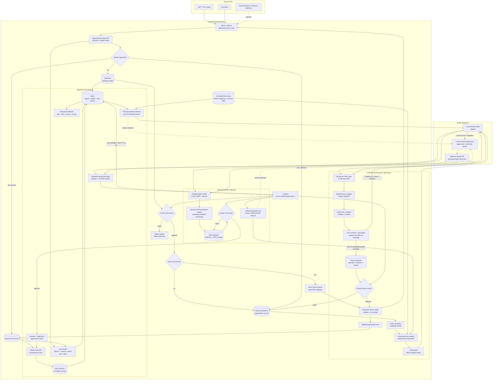
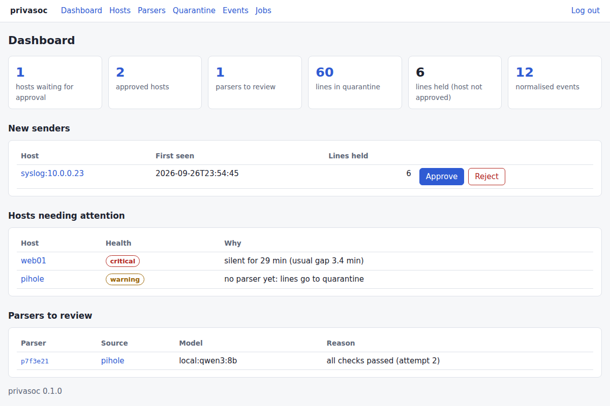
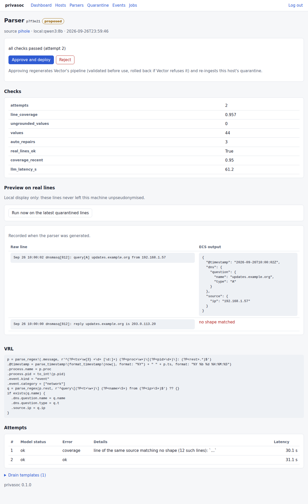

# privasoc

> Part of the [privasoc+](../..) monorepo (`packages/privasoc`). Run commands from this folder after `uv sync --all-packages` at the root. New decisions go to [`docs/DECISIONS.md`](../../docs/DECISIONS.md) at the repository root; [`docs/DECISIONS.md`](docs/DECISIONS.md) here is the frozen history (D1 to D62, I1 to I48).

**A privacy-first, local-LLM SOC analyst that writes its own log parsers.**

Point any log source at privasoc. Lines it cannot parse go to a quarantine; a small
local LLM then writes a [VRL](https://vector.dev/docs/reference/vrl/) parser that
normalises them to [ECS](https://www.elastic.co/guide/en/ecs/current/index.html),
tests it in Vector's sandbox, and asks a human to approve it. Nothing leaves your
machine un-pseudonymised: every prompt, local or remote, goes through a
shape-preserving pseudonymisation layer, and leakage is measured, not assumed.

> Status: **steps 1-7 of 8 done**; triage evaluation and Windows/Proxmox collection remain.
> See the [roadmap](#roadmap) and every design
> decision, with its rationale, in [docs/DECISIONS.md](docs/DECISIONS.md).

## Why, and what it is not

privasoc does **not** replace Logstash, Vector or vendor integrations: it runs on Vector and
uses existing parsers first. On formats someone already wrote a parser for, that parser wins
(hand-written reference F1 0.87 vs 0.53 for the local model, see below).

The model is the **last resort**, for the long tail no integration covers: in-house
applications, rare devices, formats changed by a firmware update. There, writing and
maintaining a parser costs an engineer hours per format; privasoc drafts one in seconds,
proves it on the real lines, and a human approves it. The quarantine doubles as a drift
detector: a line no parser recognises is kept and flagged, never silently mis-parsed.

- **Verifiable, not trusted**: every proposal compiles in Vector's sandbox, runs on held-out
  lines, and every extracted value must be grounded in the raw line (no invented values in
  90 evaluation runs).
- **Private by construction**: local model by default; pseudonyms keep the *shape* of what
  they replace, so a parser written on pseudonymised samples works on real data; leakage is
  measured, not assumed.

## How a source is onboarded

1. Point the device at privasoc (e.g. Pi-hole: remote syslog to `privasoc:5514`).
2. privasoc sees a **new sender** and lists it as *pending*; its lines are held, not ingested
   and not shown to any model, until a human approves the host (`privasoc hosts approve`).
3. privasoc checks whether the format is **already known**: Vector's built-in parsers
   (Apache/nginx combined and common log, CEF...) and already-approved parsers.
4. **Known**: lines go straight to ECS fields through a fixed, tested mapping. No LLM.
5. **Unknown**: lines stay in quarantine; the local model proposes a parser
   (`privasoc propose`), a human reviews and approves it (`privasoc parsers approve`).
6. On approval the parser is deployed to Vector (hot reload) and the **quarantined backlog is
   re-ingested**, so nothing received before the approval is lost.

Every approved host then has a **health status** (`privasoc hosts list`, `/health/hosts`):
silence longer than its usual rhythm (a silent firewall is a security signal), volume drops
or spikes against its own baseline, parse rate (a drop means the format drifted) and clock
skew, each as `ok` / `warning` / `critical` with the reason.

## Architecture



Solid arrows are implemented data or control flows. The dotted collector is planned for
step 8. Raw or re-identified values stay inside the local boundary; every model-bound path
passes through pseudonymisation and the leak guard, with an additional local residual pass
before a remote call.

## Quick start

Requirements: [uv](https://docs.astral.sh/uv/), the [Vector](https://vector.dev/download/)
binary (its VRL runtime is the parser sandbox) and any OpenAI-compatible LLM server,
e.g. [Ollama](https://ollama.com) with `ollama pull qwen3:8b`.

```bash
uv sync
uv run privasoc init            # writes .env with fresh secrets
# edit .env: PRIVASOC_LLM_LOCAL_MODEL=qwen3:8b, PRIVASOC_VECTOR_BIN=/path/to/vector

uv run privasoc import examples/pihole.log --source pihole   # synthetic data; a file import
                                                             # approves its host
uv run privasoc quarantine                                   # unknown lines per source
uv run privasoc propose --source pihole                      # the LLM writes a parser
uv run privasoc parsers show <id>                            # VRL, checks, preview
uv run privasoc parsers approve <id>                         # human decision + backfill
uv run privasoc hosts list                                   # senders, status, health
uv run privasoc rules learn --source pihole                  # local model: what is missed?
uv run privasoc rules preview <id> ; uv run privasoc rules approve <id>
uv run privasoc serve                                        # API + review UI
```

Every CLI decision is also in the **review UI** at `http://<host>:8000/ui/` (sign in with
`PRIVASOC_API_TOKEN`; set `PRIVASOC_HOST=0.0.0.0` to reach it from the LAN): approve new
senders, see host health, start a parser proposal, review it (checks, spec, VRL, attempts,
preview, and a live run on the latest quarantined lines), then approve or reject it.
Quarantined lines are shown pseudonymised unless you ask for raw. No asset is loaded from a
third-party host. The responsive shell provides active navigation, denser operational cards,
clear review states, accessible focus styles and matching light/dark themes without changing
the server-rendered, no-third-party architecture.



<details><summary>Parser review page</summary>



</details>

Screenshots use synthetic demo data.

By default the model does not write code: it answers with a small YAML spec (a regex and
an ECS mapping per line shape), which privasoc validates and compiles to VRL itself. Small
local models are far more reliable this way; `--mode vrl` asks for free-form VRL instead.
`propose` prints each attempt (`spec`, `compile`, `runtime`, `schema`, `ungrounded` or `ok`).
When the local model gives up, stagnates or hallucinates, it stops and suggests
`--provider remote`; set `PRIVASOC_AUTO_FALLBACK=true` to escalate automatically. Either way
the remote model only ever sees pseudonymised lines.

Live mode: the composition is in [`deploy/`](../../deploy) at the repository root (`docker compose --env-file .env up -d --build` from there), then send syslog to UDP/TCP `5514` or drop `*.log`
files in `data/inbox/`; new senders appear as pending in the UI and in `privasoc hosts list`. Approving a parser regenerates `vector/pipeline.yaml`, which Vector
hot-reloads.

Example (real output):

```text
raw:           time="1727344862" src="192.168.1.10" dst="8.8.8.8" user="jdoe"
pseudonymised: time="1727344862" src="10.134.164.171" dst="198.18.88.159" user="user-05c69e"
```

Private IPs stay private (10/8), public IPs map to the never-routed 198.18.0.0/15,
subnets and domain hierarchies stay consistent, and the mapping is kept in a local,
encrypted vault so answers can be re-identified for display only.

## Evaluation

```bash
uv run privasoc eval fetch                      # Elastic ground truth, 10 formats (not redistributed)
uv run privasoc eval leak                       # pseudonymisation leakage, no LLM needed
uv run privasoc eval learn --set dev            # step 5: learned rules, held-out leakage
uv run privasoc eval run --runs 3 --modes structured,vrl --pseudo on,off
uv run privasoc eval report                     # reports/eval.md + reports/eval.html
```

Each fixture is split in two: the model only ever sees the first half; parsers are scored
field by field on the second half against Elastic's own pipeline output. Full numbers:
[reports/eval.md](reports/eval.md).

Results with `qwen3:8b` (Q4, 8 GB consumer GPU, 3 runs per format):

| | parsers proposed (pass@1 / pass@3) | field F1 when proposed | invented values |
|---|---|---|---|
| free-form VRL | 0 % / 0 % | n/a | n/a |
| **structured spec** (dev, 10 formats) | **70 % / 80 %** | **0.53** | **0** |
| structured, pseudonymisation off | 70 % / 70 % | 0.57 | 0 |
| structured (holdout, 4 unseen formats) | 67 % / 75 % | 0.21 | 0 |
| hand-written reference spec | 100 % | 0.87 | 0 |

What it says: a small local model cannot write code in a niche language, but it can fill a
structured spec that privasoc validates, repairs and compiles; pseudonymisation costs
little quality; and field mapping on unseen formats is where the remaining gap is.
Pseudonymisation leakage went from 26.8 % (first regex detectors) to 8.1 % after the
detectors were improved against these measurements.

**Learned pseudonymisation** (step 5): the local model reads the lines of a source after
pseudonymisation and lists names still in clear; privasoc turns them into rules (the key they
follow, the words around them, or the value itself) that a human approves after a preview.
Measured with every proposal accepted, rules learned on half of each format and leakage
measured on the other half:

| | leaked before | leaked after | rules | precision |
|---|---|---|---|---|
| dev (10 formats) | 8.9 % | **3.9 %** | 9 | 0.85 |
| holdout (4 formats) | 2.4 % | 2.4 % | 2 | n/a |

The gain comes from formats with names in positional columns or sentences (squid, Cisco
ASA); on the holdout formats the detectors already caught almost everything. The learning
pass sends clear-text lines, so it only talks to a model on this machine or the local
network (checked in code); before any remote API call it runs on the samples first.

## Detection and triage

Normalised events go through Sigma rules: privasoc's own (SSH brute force, port scan, web
content scanning, long DNS labels) and the SigmaHQ rules for DNS, firewalls, proxies, web
servers and Linux (`privasoc sigma fetch`, Detection Rule License 1.1, never committed; 70 of
the 72 run, the two others are listed with the field they miss). The engine is a small
Sigma evaluator of our own, with Sigma 2 correlations. Alerts also come from host health
(a firewall that goes silent) and from new senders waiting for approval; one webhook
(JSON, ntfy, Discord or Slack) carries title, level and count, never event content.

Each alert can be triaged by the local model (or, on request, the remote one) on
pseudonymised evidence. The answer has a fixed structure (verdict, severity, confidence,
reasons citing event ids, next steps, ATT&CK ids) and is checked: a claim citing an event
that is not in the evidence, an ATT&CK id the rule does not carry, or an address the
evidence does not contain is flagged. The analyst closes the alert as a true positive, a
false positive or benign activity, with the time of closing: that is what step 8 will
measure the triage against.

```bash
uv run privasoc sigma fetch        # SigmaHQ subset into data/sigma/
uv run privasoc detect             # one detection pass (serve runs it every minute)
uv run privasoc alerts list ; uv run privasoc alerts triage <id> ; uv run privasoc alerts close <id> tp  # or fp, benign
```

## Measuring the triage (step 8)

The triage is measured on synthetic incidents with a known verdict: 16 families over the
four privasoc rules (true positives, benign activity, false positives), dev and holdout,
two variants each, plus injection twins. The incidents go through the real detection, which
must raise exactly one alert per case, then through the triage on pseudonymised evidence.
Protocol, metrics and the thresholds fixed before any result: D57, corrected by D59.
Intervals resample scenario families, keeping their variants and repeated runs together;
paired comparisons refuse missing runs, duplicates or inconsistent labels.

```bash
uv run privasoc eval triage --set all --runs 3              # local model
uv run privasoc eval triage --set all --provider always-tp  # baseline without a model
uv run privasoc eval triage-report                          # reports/triage.md
uv run privasoc eval triage-report --compare qwen3:8b,<remote model>
```

Building the bench found two pseudonymisation bugs, now fixed (I42), and two limits worth
knowing: the evidence holds only the events that matched (not the login that followed a
brute force), and pseudonymised domain and user names hide what made them suspicious.

## AI-written rules and hunting

Ask a question about past events or describe what to detect; the local model answers with a
Sigma rule (never SQL), written on pseudonymised examples, which privasoc checks with the
same engine, re-identifies and **backtests** on the stored events. An alert closed as a
false positive can be turned into a fix of its rule, shown with the past alerts it would
remove and, above all, any true positive it would hide. This comparison executes the whole
candidate, including correlation thresholds, on each alert's evidence. Generated ids and
names are isolated from every loaded rule. Nothing runs until you approve it.

On a hand-written bench (synthetic events with a known answer, `qwen3:8b`, 3 runs per
request):

| | valid rule | exact answer | precision | recall |
|---|---|---|---|---|
| dev (10 requests, used to improve prompts) | 97 % | 83 % | 0.85 | 0.90 |
| holdout (10 requests, never tuned on) | 97 % | 47 % | 0.57 | 0.52 |

The gap is the honest part: on unseen requests the model often writes exact values where a
prefix was needed, or adds conditions nobody asked for. The backtest is what makes this
safe to use: a rule that matches nothing, or too much, is visible before approval.

```bash
uv run privasoc hunt "Which sources failed SSH more than 20 times within 5 minutes?"
uv run privasoc ai-rules write "DNS queries for domains ending in .zip"
uv run privasoc ai-rules from-alert <id> --false-positive
uv run privasoc eval hunt --set all --runs 3
```

## Privacy model

| Guarantee | How |
|---|---|
| No original value in any prompt | Typed detectors + key=value heuristics + propagation; automatic leak check before sending; the local residual pass also checks existing rule text before remote rule authoring |
| Deterministic, reversible only locally | Keyed HMAC pseudonyms; Fernet-encrypted vault, mode 600, git-ignored |
| No secret or personal log in git | `.gitignore` for `data/` and `.env`; `gitleaks` in pre-commit and CI |
| Remote API is opt-in | Local model by default; API only on explicit action or configured fallback, every call logged |
| One audited way out (optional) | The remote endpoint can be a [sovereign-llm-gateway](../gateway) instance with its privasoc profile: it leaves privasoc's tokens alone, requires an authenticated manifest of minted IP/MAC tokens and blocks unlisted addresses, spotlights the evidence and keeps a hash-chained audit (I40) |
| What regexes miss is learned | Local-only model pass proposes rules (key, context, value), encrypted in the vault, human-approved; it also runs before every remote call |

Triage evidence is wrapped in `<document>` tags for every model, and log text that tries to
close the envelope is escaped: log fields are written by whoever generated the traffic.

Known limits are documented rather than hidden: regex detection has residual leakage
on free text; step 5 adds a local-LLM pass and the evaluation publishes both rates.

## Roadmap

1. **Core**: Vector → quarantine → SQLite, regex pseudonymisation, CLI. ✅
2. **Parser generation loop**: sandbox, Drain sampling, anti-hallucination, API fallback. ✅
3. **Parser evaluation** on Elastic integration fixtures + HTML report. ✅
   Source onboarding (pending hosts, known formats first, backfill) and host health. ✅
4. **Web review UI**: hosts, health, parser review, quarantine, events. ✅
5. **Local-LLM pseudonymisation that learns** (human-approved rules, UI page). ✅
6. **Sigma detection + alerts + structured AI triage**. ✅
7. **AI-written Sigma rules, natural-language hunting**, with a bench. ✅
8. Triage evaluation (bench and harness done, model results to come); Windows and Proxmox
   collection.

## Development

```bash
uv sync && uv run pytest -q && uv run ruff check .
pre-commit install
```

MIT licence.


The dedicated gateway profile now requires `_privasoc_address_tokens` (I43): the client
collects only IP/MAC tokens actually minted in its local vault and present in the request.
The gateway removes this metadata before forwarding. A raw address in 10/8 or a MAC
starting with 02 is no longer trusted merely because it resembles a token. Residual names
still need a local residual pass and an active gateway NER backend; these controls do not
prove anonymisation. Local-only checks also reject DNS aliases of the remote endpoint,
but cannot attest that an arbitrary LAN server has no external relay.

### Public samples for local testing

Manual-test corpus in `data/samples-manual/2026-10-07/` (git-ignored, outside the watched inbox): Loghub SSH/Linux/Apache-error samples and development Elastic web/firewall fixtures. Licences, pinned URLs and hashes are kept alongside the files. The user-authorised ingestion loaded 6,111 lines once: 13 normalised Nginx events and 6,098 quarantined lines. Six local structured parser attempts (two tries per source) ended in `needs_escalation`; none was activated. No sample alerts or external-model calls. This checks ingestion and reveals parser limitations; it is not an attack-labelled accuracy benchmark. Do not repeat the imports without handling duplicates. Elastic data remains local-only (I45).

### Parsing follow-up

The fixed format catalogue now supports mixed Apache common/combined access records,
optional vhost and duration columns, and legacy Apache error records. Unknown formats
still stay in quarantine; model proposals require human approval. YAML feedback now
includes the exact problem and location without copying input text.

On the same seven local public samples, reprocessing existing quarantine moved 2,017
Apache lines into events: 2,030 normalised, 4,081 quarantined. One Linux proposal passed
technical checks but remains inactive and mostly extracts header/message. SSH,
iptables and Check Point remain unresolved. These counts are not detection accuracy.

Validation 2026-10-07: 205 tests passed with the configured native Vector binary, none skipped; ruff passed. API health and authenticated Linux parser review returned HTTP 200 after restarting the local-only server. Sample alerts: seven host-health alerts, zero Sigma detection alerts.

### Linux parser review example

`examples/linux-system.yaml` is an opt-in structured spec for classic Linux syslog:
process/PID, PAM authentication failures, SSH logins, FTP connections and sessions.
Unknown bodies keep their message without a fabricated outcome. Compile and review
it through the existing structured parser and approval workflow; it is not an
automatic built-in. Yearless headers infer the current year. Local sample field
presence is not extraction accuracy.
